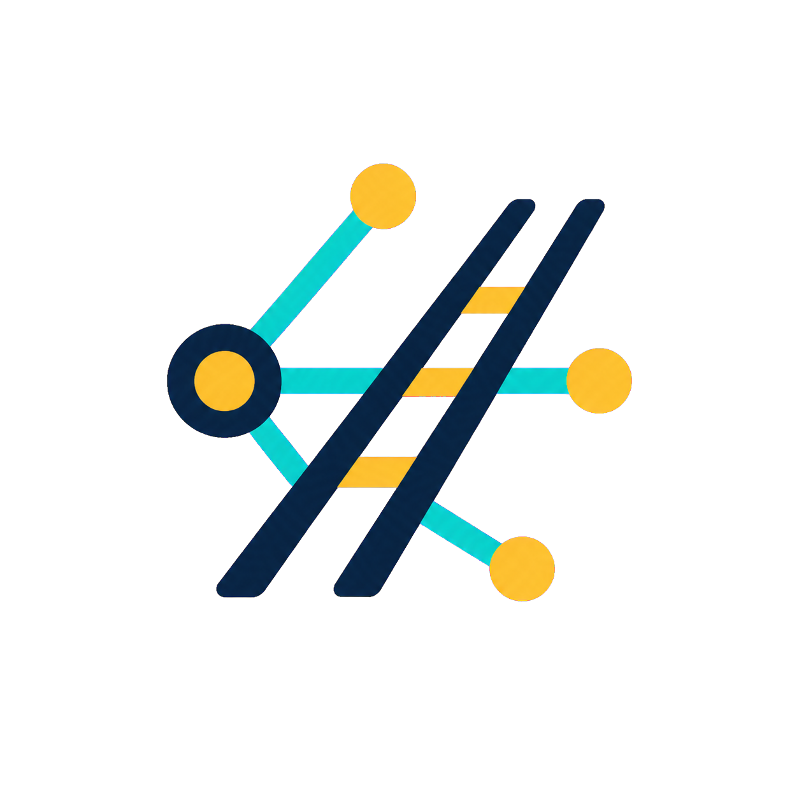

<p align="center">
  
</p>

<h1 align="center">KnowledgeRail</h1>

KnowledgeRail is a local-first MCP server that turns project documentation and source code into durable, evidence-backed context for AI agents.

It is designed for agents that need to understand, change, review, or document a codebase without loading the whole repository into the model context. Retrieval is bounded, provenance is preserved, missing evidence is reported explicitly, and difficult queries widen progressively instead of silently losing relevant information.

> **Current status:** release candidate `1.0.0`. The server uses MCP SDK `2.x` and protocol `2026-07-28`. It supports path-free local `stdio`, a self-hosted loopback HTTP gateway, and a local desktop-chat adapter. KnowledgeRail operates no hosted service and does not upload project data. See [SELF_HOSTING.md](SELF_HOSTING.md).

## What it provides

- Eight domain-oriented tools with validated actions and machine-readable next steps.
- Task-aware hybrid retrieval with lexical, graph, passage, and optional semantic evidence.
- Progressive widening with explicit coverage signals and `GAP`/unknown reporting.
- Complete source ingestion through bounded segments, a coverage ledger, and durable Evidence IR.
- A deterministic TypeScript/JavaScript code index with symbol and reference lookup.
- Incremental graph, retrieval, and semantic indexes stored beside the project wiki.
- Contract-driven Markdown deliverables and gated DOCX export with Mermaid diagrams.
- Conservative migration of existing v1/v2/v3 wikis.
- Automatic per-process workspace binding for IDEs and terminal agents.
- A local HTTP gateway that keeps concurrent clients and projects isolated per request.
- A desktop-chat workspace catalog with opaque, expiring per-chat bindings.

KnowledgeRail does not call an LLM itself. The connected MCP client chooses and calls the tools. OCR and embeddings are optional external providers configured by the user.

## Requirements

- Node.js `22.12.0` or newer
- npm
- macOS, Windows, or Linux

Mermaid CLI and its compatible Chromium runtime are installed with the package. A separate global Mermaid installation is not required.

## Quick start with npx

Run this from any directory inside the project you opened in VS Code, Cursor, a terminal, or another context-aware coding client:

```bash
npx -y knowledge-rail@<exact-version>
```

No project path is needed in the persistent MCP configuration. KnowledgeRail discovers the opened project independently for each process, so project X and project Y can be used at the same time by different agent sessions.

The npm package is not considered available until the maintainers publish the reviewed release. Until then, use the source-checkout commands below. Pin an exact version in persistent configurations after publication; reserve `@latest` for one-time trials.

## Install and run from source

### From source

```bash
git clone https://github.com/Deviank88/KnowledgeRail.git
cd KnowledgeRail
npm ci
npm run build
```

Start it from any directory inside the project whose knowledge you want to manage:

```bash
cd /path/to/your-project
node /absolute/path/to/KnowledgeRail/dist/index.js
```

## IDE, Cursor and terminal configuration

Use the standard `stdio` server shape once. Do not hard-code one repository:

```json
{
  "mcpServers": {
    "knowledge-rail": {
      "command": "npx",
      "args": ["-y", "knowledge-rail@<exact-version>"]
    }
  }
}
```

For a source checkout, replace `knowledge-rail` with Node and the compiled entry point:

```json
{
  "mcpServers": {
    "knowledge-rail": {
      "command": "node",
      "args": ["/absolute/path/to/KnowledgeRail/dist/index.js"]
    }
  }
}
```

The workspace is resolved separately for every launched server with this precedence: explicit `--root`; one unambiguous legacy MCP Root; `WIKI_ROOT` for compatibility; the nearest existing KnowledgeRail marker; the nearest project/VCS marker; finally a safe non-empty cwd. Filesystem roots, the user home, package caches, and known desktop-application directories fail closed. `--root <absolute-path>` remains an operator troubleshooting override, not normal configuration.

When a client has multiple open roots, its integration must launch KnowledgeRail with the active project as cwd (or expose one unambiguous legacy Root). KnowledgeRail never chooses the first root silently and never sends an IDE user through the desktop workspace selector.

## Claude Desktop and other context-free desktop chats

A desktop chat does not open a filesystem folder, so it cannot safely infer a project from its process cwd. Configure the local adapter once:

```json
{
  "mcpServers": {
    "knowledge-rail": {
      "command": "npx",
      "args": ["-y", "knowledge-rail@<exact-version>", "desktop"]
    }
  }
}
```

For a source checkout, use `node /absolute/path/to/KnowledgeRail/dist/index.js desktop`. The adapter discovers or starts the protected loopback gateway automatically and exposes `knowledge_workspace` in addition to the eight domain tools.

In a new chat, ask KnowledgeRail to list workspaces, choose one entry, and confirm `read` or `write` access. The returned opaque binding belongs to that conversation and must accompany its later domain calls. Two chats can select different customers/projects concurrently. Start a new chat when changing customer workspace: filesystem access is isolated, but information already present in conversation history cannot be removed by the server.

Projects opened successfully by an IDE/terminal are added to the local catalog automatically without changing their clean eight-tool workflow. Operators can also manage catalog metadata locally:

```bash
npx -y knowledge-rail@<exact-version> workspace list
npx -y knowledge-rail@<exact-version> workspace register
npx -y knowledge-rail@<exact-version> workspace register /absolute/project/path
npx -y knowledge-rail@<exact-version> workspace unregister ws_example
```

Registration never copies, uploads, scans the disk, or deletes project files. `workspace register` without a path discovers only upward from cwd.

## Local self-hosted HTTP gateway

Start one gateway for many concurrent local clients and workspaces:

```bash
npx -y knowledge-rail@<exact-version> --transport http
```

The default endpoint is `http://127.0.0.1:3333/mcp`; liveness only is available at `/healthz`. MCP requests require the random credential stored in the OS-protected per-user KnowledgeRail state directory. The desktop adapter reads it automatically, so it never belongs in project configuration or a repository.

The gateway does not have a current root. Every filesystem-capable request must resolve a valid opaque binding before the first path access. Bindings are scoped, expiring, revocable, and invalidated on gateway restart. Resource links are workspace-qualified and revalidated when read.

The shipped gateway deliberately rejects non-loopback binding. It is local self-hosting, not public OAuth or hostile-user multi-tenancy. `claude.ai` and Claude remote custom connectors cannot use a localhost endpoint because those connections originate from the provider cloud; Claude Desktop local MCP uses the `desktop` adapter above.

| Client context | Entry point | Workspace behavior | Tool catalog |
| --- | --- | --- | --- |
| VS Code, Cursor, terminal agent | default `stdio` | automatic from the opened project, per process | 8 domain tools |
| Claude Desktop/local desktop chat | `desktop` | user chooses an approved catalog entry per chat | `knowledge_workspace` + 8 domain tools |
| Generic trusted local HTTP client | `--transport http` | binding supplied on every filesystem-capable request | `knowledge_workspace` + 8 domain tools |

Platform state locations are `%LOCALAPPDATA%\KnowledgeRail` on Windows, `~/Library/Application Support/KnowledgeRail` on macOS, and `${XDG_STATE_HOME:-~/.local/state}/knowledge-rail` on Linux. Set `KNOWLEDGE_RAIL_STATE_DIR` only for controlled testing or an intentional custom local installation. Docker/devcontainers and WSL have separate filesystems and therefore separate catalogs unless their state and project mounts are explicitly shared.

### Operating-system notes

- **Windows:** if an MCP host does not resolve npm command shims, use `"command": "npx.cmd"`; escape backslashes in JSON paths (`C:\\Tools\\KnowledgeRail\\dist\\index.js`). PowerShell operator commands use the same CLI arguments shown above. Drive-letter case and junction/real paths are canonicalized before binding.
- **macOS:** the first Chromium/Mermaid use may be subject to normal Gatekeeper/browser permissions. The state directory is inside `Library/Application Support`, not the opened repository.
- **Linux:** `XDG_STATE_HOME` is honored. Headless CI/container environments may need `KNOWLEDGE_RAIL_MERMAID_NO_SANDBOX=true`, but ordinary workstations should retain Chromium sandboxing.
- **WSL and containers:** run the MCP process in the same filesystem environment as the project. A Windows Claude Desktop process and a WSL-only localhost/state directory are distinct unless an explicit bridge is configured.

## Agent workflow

KnowledgeRail exposes eight stable tools. Agents choose a domain directly and use its `mode` or `action`; no menu, profile, session scope, or legacy alias is required.

| Tool | Operations |
| --- | --- |
| `knowledge_context` | `task`, bounded page `list`, query-required `search`, and `graph`. |
| `knowledge_page` | Read, write, edit, move, delete, and append the durable log. |
| `knowledge_files` | List, read, and normalize controlled source files. |
| `knowledge_ingest` | `start`, `next`, `apply_claims`, `record_segment`, `source_status`, `evidence_status`, `finalize`, report, and recovery actions. |
| `knowledge_code` | Maintain and query deterministic code evidence. |
| `knowledge_document_context` | Plan a typed document and compile section-specific evidence. |
| `knowledge_document` | Write, review, and export deliverables. |
| `knowledge_admin` | Initialize, lint, and migrate KnowledgeRail data. |

Every successful operation returns a machine-readable `state` and either one `nextAction` or `null`. `nextAction` identifies the next tool, action, required arguments, and safe suggested arguments. Optional `guidance` and `resultText` complete the shared output envelope. Clients that only render text also receive concise `Next:` and `Guidance:` lines when applicable.

### How it works

KnowledgeRail separates context retrieval, durable memory, source ingestion, code evidence, and document production so an agent can enter at the operation it needs without learning an internal menu or carrying session state:

```text
task objective
    ↓
knowledge_context ──→ ranked evidence links + coverage gaps
    ↓                              ↓
resources/read              bounded widening, if needed
    ↓
agent reasoning and project work
    ├──→ knowledge_page / knowledge_code
    ├──→ knowledge_ingest ──→ Evidence IR ──→ canonical wiki
    └──→ knowledge_document_context ──→ knowledge_document
```

For a normal task, the agent calls `knowledge_context mode="task"` with a concrete objective. KnowledgeRail searches the canonical wiki and its derived lexical, graph, passage, code, and optional semantic indexes, ranks the available evidence, and returns a compact context envelope. Large page bodies are exposed as `knowledge-rail://` links instead of being inserted wholesale into the response; the client reads only the selected passages. If the token budget alone excluded relevant evidence, the returned `nextAction` proposes one bounded widening step. Missing, stale, contradictory, or unresolved evidence remains an explicit gap and is never filled by guessing.

Durable knowledge lives as Markdown under `wiki/`. Direct page operations preserve caller-owned content byte-for-byte. Larger source sets use `knowledge_ingest`: normalized sources are processed in bounded segments, claims are recorded in durable Evidence IR, coverage is reconciled, and finalization is blocked until every segment is represented or explicitly classified. Derived retrieval and graph indexes are refreshed from this canonical state rather than replacing it.

Document production is a separate evidence-backed workflow. `knowledge_document_context` first creates a typed plan and a bounded evidence pack for each section. `knowledge_document` then writes and reviews the deliverable against the selected contract; export re-runs that review and is refused while blockers remain. This keeps generated documents traceable to project memory without treating the deliverable itself as canonical memory.

All public actions validate their own required arguments before reading or mutating state. The shared `state`/`nextAction` envelope makes progress explicit, but a suggested next action never grants permission to perform a consequential write: the connected client retains its normal approval policy. Compatibility with older MCP clients changes only the transport adapter, not these eight tool names or their behavior.

A normal context request starts directly with:

```text
knowledge_context {
  "mode":"task",
  "intent":"understand",
  "objective":"Explain how lease renewal and expiry work",
  "response_detail":"compact",
  "heuristic_token_budget":2000
}
```

On MCP `2026-07-28`, `knowledge_context` returns selected `knowledge-rail://` resource links. The client materializes only the passages it needs with `resources/read`; clients that do not expose resource reads can use `knowledge_page action="read"` with the exact URI. When evidence was omitted only because of the budget, `nextAction` provides the next bounded widening request. Semantic, stale, or unresolved gaps are returned without a futile widening loop and must remain explicit unknowns.

The consolidated catalog is deliberately action-oriented, but validation remains action-specific. For example, `knowledge_page action="edit"` is rejected without `path`, `old_string`, and `new_string`; ingestion cannot finalize before complete coverage; document export re-runs the contract review.

Caller-owned page, file, and code bodies are never rewritten to modernize historical tool names. If a canonical `SCHEMA.md` still refers to a retired operation, `knowledge_admin action="migrate"` can propose the corresponding current operation for explicit review; reads remain byte-preserving.

A normalized-source loop is explicit and machine-guided:

```text
start → next → apply_claims or record_segment → next
      → source_status → finalize
```

Use `evidence_status` for claims and recovery debt; it is intentionally separate from per-source `source_status`. The old overloaded `apply` and `status` ingestion actions are rejected.

### Why context has a token budget

The budget bounds evidence sent to the model; it does not declare omitted knowledge irrelevant. If coverage is insufficient because of the budget, the guided read workflow widens from `2,000` to `4,000`, `8,000`, and at most `12,000` heuristic tokens. Widening stops as soon as no evidence is budget-omitted; any remaining semantic or freshness gap is exposed rather than guessed.

`response_detail="compact"` is recommended for normal agent use. `full` keeps the complete historical TaskContext payload for diagnostics and integrations that need it.

## Project data

`knowledge_admin action="init"` creates this structure inside the selected project. The roots are intentionally stable: `wiki/` is canonical agent memory; `docs/` is the document plane for sources, normalized copies, durable evidence state, and deliverables.

```text
project/
├── wiki/
│   ├── index.md
│   ├── log.md
│   ├── SCHEMA.md
│   ├── .knowledge-rail/     # derived indexes, manifests and migration state
│   └── <page-type>/         # created lazily when the first typed page is written
└── docs/
    ├── client/
    ├── transcripts/
    ├── reports/
    ├── changelogs/
    ├── normalized/
    ├── evidence-ir/         # durable Evidence IR and knowledge-recovery state
    ├── deliverables/
    └── assets/
```

Markdown pages are canonical knowledge. Files below `wiki/.knowledge-rail/` are derived or operational state and can be rebuilt where the corresponding workflow supports it. Source documents remain under `docs/`; normalization never overwrites the original.

These directories may contain private project information. Decide deliberately whether the consuming project should commit them.

## Document memory and deliverables

Document generation starts with `knowledge_document_context action="plan"`. Follow its `nextAction` to compile a separate bounded evidence pack for every section, then use `knowledge_document action="write"` and `action="review"`. `action="export"` re-reviews the current Markdown and refuses export while any contract blocker remains.

Built-in contracts cover functional specifications, architecture documents, project briefs, onboarding guides, API references, ADRs, runbooks, test plans, incident reports, and release notes. `custom` remains available for a document with an explicit structure. Each contract defines purpose, default language and audience, required sections, minimum useful content, and type-specific checks; callers can override language and client-facing status without disabling structural validation.

The generated document is an output of agent memory, not its replacement. Confirmed facts belong in `wiki/`; source artifacts remain in `docs/`; delivery-ready Markdown and DOCX files belong in `docs/deliverables/`.

## Optional OCR and semantic retrieval

Text, Markdown, JSON, YAML, CSV/TSV, XLSX, and PPTX normalization works locally. Images and PDFs require either an Ollama-compatible OCR service or a configured native OCR endpoint.

Common OCR variables:

| Variable | Purpose |
| --- | --- |
| `KNOWLEDGE_RAIL_OCR_MODE` | `ollama` (default) or `native`. |
| `KNOWLEDGE_RAIL_OLLAMA_HOST` | Ollama base URL; defaults to `http://localhost:11434`. |
| `KNOWLEDGE_RAIL_NATIVE_HOST` | Native OCR base URL; defaults to `http://localhost:5002`. |
| `KNOWLEDGE_RAIL_OCR_MODEL` | OCR model; defaults to `glm-ocr:latest`. |
| `KNOWLEDGE_RAIL_OCR_TIMEOUT_MS` | Positive request timeout in milliseconds. |
| `KNOWLEDGE_RAIL_OCR_RETRIES` | Retry count. |

Semantic retrieval is optional. Without it, deterministic lexical/graph/passage retrieval remains available. To enable an OpenAI-compatible embeddings endpoint, set all three required variables:

```text
KNOWLEDGE_RAIL_EMBEDDING_BASE_URL=https://provider.example/v1
KNOWLEDGE_RAIL_EMBEDDING_MODEL=embedding-model
KNOWLEDGE_RAIL_EMBEDDING_DIMENSIONS=1536
```

Optional embedding variables are `KNOWLEDGE_RAIL_EMBEDDING_API_KEY`, `KNOWLEDGE_RAIL_EMBEDDING_MODEL_VERSION`, and `KNOWLEDGE_RAIL_EMBEDDING_TIMEOUT_MS`.

For Mermaid rendering, `KNOWLEDGE_RAIL_MERMAID_NO_SANDBOX=true` is intended only for controlled CI/container environments that cannot launch Chromium with its sandbox. Do not enable it by default on a workstation or shared host.

## Compatibility

| Capability | Status |
| --- | --- |
| MCP SDK | official `@modelcontextprotocol/server`, `client`, and `node` `2.x` packages |
| Modern protocol | `2026-07-28` |
| IDE/terminal transport | local `stdio`, automatic project root, exact eight-tool bound profile |
| Local HTTP transport | self-hosted loopback gateway, stateless per-request workspace resolution |
| Desktop chat | local `stdio`-to-HTTP adapter with user-selected opaque per-chat binding |
| Legacy wire adapter | Served for existing 2025-era clients with the same eight public tool names |
| Modern selective reads | MCP `resources/read` |
| Public/hosted Streamable HTTP | Not implemented; the shipped gateway rejects non-loopback binding |
| Claude remote connectors to localhost | Not supported; use Claude Desktop local MCP |
| Serverless multi-tenant storage | Not implemented |

All public tools use the `knowledge_*` prefix in both protocol eras. Historical `wiki_*` tools and `knowledge_menu` are not advertised. The legacy adapter is transport/workspace compatibility only: it does not restore the old tool catalog. Conservative migration of existing wiki data remains supported independently of protocol compatibility.

## Development and verification

```bash
npm ci
npm run verify
npm run audit:runtime
npm run package:smoke
```

Run all deterministic retrieval and quality gates:

```bash
npm run eval:gates
```

The aggregate command runs these unchanged individual gates:

```bash
npm run eval:retrieval:gate
npm run eval:hybrid:gate
npm run eval:widening:gate
npm run eval:source-coverage:gate
npm run eval:evidence-ir:gate
npm run eval:code-evidence:gate
npm run eval:recovery:gate
npm run eval:task-context:gate
npm run eval:semantic:gate
npm run eval:migration:gate
npm run eval:editorial:gate
npm run eval:documents:gate
npm run eval:tool-surface:gate
```

The benchmark fixtures and acceptance rules are documented in [benchmarks/README.md](benchmarks/README.md). CI verifies Node.js 22 and 24, all regression gates, benchmark smoke tests, the runtime dependency audit, and installed-tarball smokes on Ubuntu, macOS, and Windows.

See [CONTRIBUTING.md](CONTRIBUTING.md) before opening a pull request and [SECURITY.md](SECURITY.md) for vulnerability reporting.

## License

Licensed under the [Apache License 2.0](LICENSE). You may use, modify, and distribute the project, including commercially, subject to the license terms and preservation of required notices. The license does not require derivative products to be open source.

## Origins and acknowledgement

KnowledgeRail is an independent project. Its starting point was inspired in part by Andrej Karpathy's [LLM Wiki idea file](https://gist.github.com/karpathy/442a6bf555914893e9891c11519de94f): an LLM maintains durable Markdown knowledge that compounds instead of reconstructing everything from raw sources on every query.

KnowledgeRail has since evolved into a distinct MCP 2.0 agent-memory system with bounded hybrid retrieval, coverage and gap reporting, Evidence IR, deterministic code evidence, migration support, and contract-driven document production. It is not affiliated with or endorsed by Andrej Karpathy. See [ACKNOWLEDGEMENTS.md](ACKNOWLEDGEMENTS.md).
